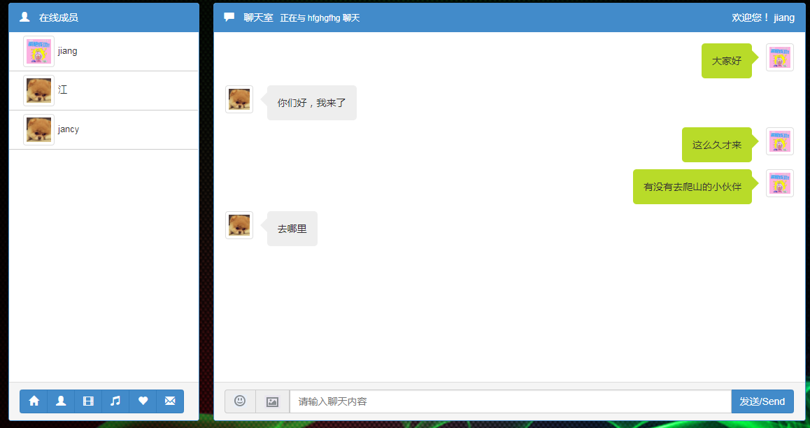

# 使用 Koa2构建一个图书站点, 练习 socket.io,nunjucks,等技术使用 (纯学习项目，很杂，想加入啥就加入啥)

## 1、安装包

+ 1、`npm init -y`
+ 2、`cnpm i -S koa koa-router koa-views nunjucks koa-static koa-bodyparser koa-json kcors koa-logger log4js`
+ 3、安装调试工具 并配置package.json中的运行脚本
``` 
cnpm i -D nodemon

scripts:{
	"dev":"nodemon -w src src/app.js"
}
```

+ 4、`cnpm i -S socket.io`

`var server = require('http').Server(app.callback());`

src/app.js
```
const Koa=require('koa')
const path=require('path')
const views=require('koa-views')
const nunjucks=require('nunjucks')
const cors=require('kcors')
const json=require('koa-json')
const koaLogger=require('koa-logger')              //开发阶段的终端日志（访问日志）
const bodyparser=require('koa-bodyparser')
const static=require('koa-static')                 //静态资源
const router=require('./router/routes')            //路由
const chat=require('./socket/chat')


const app=new Koa()

// 静态资源目录对于相对入口文件app.js的路径
app.use(static(path.join( __dirname,  './public')))

const nunjucksEnv = new nunjucks.Environment(
    new nunjucks.FileSystemLoader(path.join(__dirname, 'view'))
)
//使用nunjucks模板
app.use(views(path.join(__dirname, './view'),{
    options: {
        nunjucksEnv: nunjucksEnv
    },
    map:{html:'nunjucks'}
}))

app.use(koaLogger())  //开发日志
app.use(cors({credentials: true}))       //允许跨域,并且允许附带cookie
app.use(json())       
app.use(bodyparser())

//加载路由
router(app);

const config = require('./config/config')   //配置文件

// 必须放在所有app.user()之后
var server = require('http').Server(app.callback());
chat.initialize(server)

//通过process.env.NODE_ENV来判断是开发还是生产环境,从而加载不同的配置信息
const env = process.env.NODE_ENV || 'development' // Current mode

server.listen(config[env].port,()=>{
  console.log(`✅ server is running at http://localhost:${config[env].port}`)
})

```

src/router/routes.js
```
const Router = require('koa-router')

module.exports = app => {
  const router = new Router()
  //const apiRouter = new Router()

  router.get('/', async (ctx, next) => {
    var vm = {
      title: '首页'
    }
    await ctx.render('index', vm)
  })


  //apiRouter.post('/user/login',app.controller.user.login)
  //apiRouter.get('/user/getall',app.controller.user.getAll)

  //设定api路由为router的子路由
  //router.use('/api', apiRouter.routes(), apiRouter.allowedMethods())

  //如果匹配不到路由则返回404
  router.all('/*', async (ctx, next) => {
    ctx.response.status = 404;
    ctx.response.body = `<h1>~~oops page not found!</h1>`
  })
  app.use(router.routes()).use(router.allowedMethods())
}
```

src/config/config.js
```
module.exports={
	//开发环境配置
	development:{
		port:3000,  //启动端口
		//数据库配置
		database:{
			user:'root',
			host:'localhost',
			password:'123456',
			database:'nodeserverdb',
			port:'3306'
		}
	},
	//生产环境配置
	production:{
		port:4090,  //启动端口
	  //数据库配置
	  database:{
			user:'root',
			host:'localhost',
			password:'123456',
			database:'nodeserverdb',
			port:'3306'
		}
	}
}
```


## 2、加入 mvc的controller和service的中间件
## 3、加入 log4js日志记录 cnpm i -S log4js  日志文件的配置在 config/log_config.js

## 4、增加 md5 加密模块 （对密码md5加密）
```
cnpm i -S md5

const md5 = require('md5')
let md5Pwd=md5('123456')
```
## 5、加入jsonwebtoken 及koa-jwt中间件 对api数据的获取进行token认证
```
cnpm i -S jsonwebtoken koa-jwt

app.use(async function (ctx, next) {     //如果返回的是401未授权status
    try {
      await next()
    }
    catch (err){
      if (401 == err.status) {
        ctx.status = 401
        ctx.body = '您未提供Authorization header或者身份过期,请登录获取。'
      } else {
        throw err
      }
    }
  })

  /* 路由权限控制 */
  app.use(jwtKoa({ secret: config.tokenSecret }).unless({
    // 设置login、register接口，可以不需要认证访问
    path: [
      /^\/api\/user\/loginAction/,         //登录接口
      /^\/api\/user\/logout/,              //退出接口
      /^((?!\/api).)*$/   // 设置除了私有接口外的其它资源，可以不需要认证访问
    ]
  }))

  app.use(async function (ctx, next) {     // 如果是携带了token的请求,解析这个token并 放置在ctx.user下
    try {
      const authorization = ctx.header.authorization  // 获取jwt
      if(authorization) {
        let token=authorization.split(' ')[1]
        if(token && token.length>10){ //客户端传过来的Authorization: Bearer null会被解析成token为"null",简单点用长度来过滤
          let payload = await jwt.verify(token, config.tokenSecret)  // 解密，获取payload
          ctx.user=payload
        }        
      }
      await next()
    }
    catch (err){
      err.status=401
      throw err
    }
  })
```


## 使用Socket.io的聊天, 代码位置 src/socket/chat.js



# 碰到问题记录

+ vue的绑定方法和nunjucks的{{}}方式冲突，更改vue的绑定方式 `delimiters: ['${', '}'],`    绑定的时候使用 ${dialog.content}

